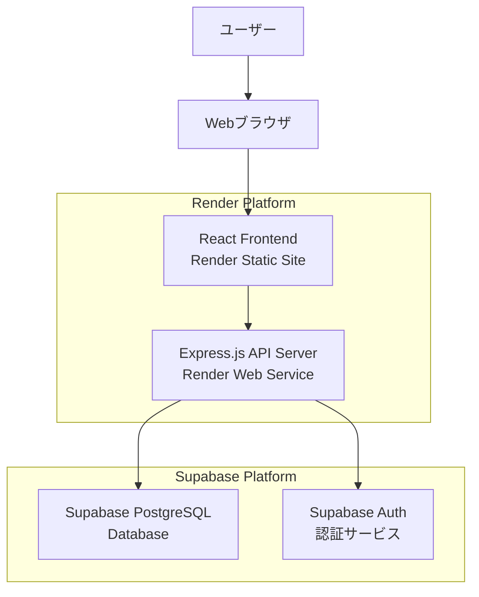

# 設計文書

## 概要

英単語帳Webサービスは、ユーザーが英単語を効率的に学習できるWebアプリケーションです。Renderでホスティングし、SupabaseをDBaaSとして使用します。レスポンシブデザインでPC・モバイル両対応し、フラッシュカード学習機能と進捗管理機能を提供します。

## アーキテクチャ

### システム構成



### 技術スタック

**フロントエンド:**
- React 18 + TypeScript
- Tailwind CSS (レスポンシブデザイン)
- React Router (SPA routing)
- Axios (API通信)

**バックエンド:**
- Node.js + Express.js
- TypeScript
- Supabase JavaScript Client

**データベース:**
- Supabase PostgreSQL
- Row Level Security (RLS) 有効

**ホスティング:**
- Render Web Service (API)
- Render Static Site (Frontend)

## コンポーネントと インターフェース

### フロントエンドコンポーネント

```
src/
├── components/
│   ├── common/
│   │   ├── Header.tsx
│   │   ├── Navigation.tsx
│   │   └── LoadingSpinner.tsx
│   ├── vocabulary/
│   │   ├── VocabularyList.tsx
│   │   ├── VocabularyForm.tsx
│   │   ├── VocabularyCard.tsx
│   │   └── SearchFilter.tsx
│   ├── study/
│   │   ├── FlashCard.tsx
│   │   ├── StudySession.tsx
│   │   └── StudyResults.tsx
│   └── dashboard/
│       ├── Dashboard.tsx
│       ├── ProgressChart.tsx
│       └── StatsSummary.tsx
├── pages/
│   ├── HomePage.tsx
│   ├── VocabularyPage.tsx
│   ├── StudyPage.tsx
│   └── DashboardPage.tsx
├── hooks/
│   ├── useVocabulary.ts
│   ├── useStudySession.ts
│   └── useAuth.ts
└── services/
    ├── api.ts
    ├── auth.ts
    └── types.ts
```

### API エンドポイント

```
GET    /api/vocabulary          # 単語一覧取得
POST   /api/vocabulary          # 単語作成
GET    /api/vocabulary/:id      # 単語詳細取得
PUT    /api/vocabulary/:id      # 単語更新
DELETE /api/vocabulary/:id      # 単語削除

GET    /api/study/session       # 学習セッション開始
POST   /api/study/result        # 学習結果記録

GET    /api/dashboard/stats     # ダッシュボード統計
GET    /api/dashboard/progress  # 学習進捗データ

POST   /api/auth/login          # ログイン
POST   /api/auth/register       # ユーザー登録
POST   /api/auth/logout         # ログアウト
```

## データモデル

### データベーススキーマ

```sql
-- ユーザーテーブル (Supabase Auth使用)
-- auth.users テーブルを使用

-- 単語テーブル
CREATE TABLE vocabulary (
    id UUID PRIMARY KEY DEFAULT gen_random_uuid(),
    user_id UUID REFERENCES auth.users(id) ON DELETE CASCADE,
    english_word VARCHAR(255) NOT NULL,
    example_sentence TEXT,
    difficulty_level INTEGER DEFAULT 1,
    mastery_level INTEGER DEFAULT 0, -- 0: 未学習, 1: 学習中, 2: 習得済み
    created_at TIMESTAMP WITH TIME ZONE DEFAULT NOW(),
    updated_at TIMESTAMP WITH TIME ZONE DEFAULT NOW()
);

-- 日本語訳テーブル (複数訳語対応)
CREATE TABLE japanese_meanings (
    id UUID PRIMARY KEY DEFAULT gen_random_uuid(),
    vocabulary_id UUID REFERENCES vocabulary(id) ON DELETE CASCADE,
    meaning TEXT NOT NULL,
    part_of_speech VARCHAR(50), -- 品詞 (名詞、動詞、形容詞など)
    usage_note TEXT, -- 使用上の注意
    created_at TIMESTAMP WITH TIME ZONE DEFAULT NOW()
);

-- 学習履歴テーブル
CREATE TABLE study_sessions (
    id UUID PRIMARY KEY DEFAULT gen_random_uuid(),
    user_id UUID REFERENCES auth.users(id) ON DELETE CASCADE,
    vocabulary_id UUID REFERENCES vocabulary(id) ON DELETE CASCADE,
    is_correct BOOLEAN NOT NULL,
    response_time INTEGER, -- ミリ秒
    studied_at TIMESTAMP WITH TIME ZONE DEFAULT NOW()
);

-- 学習統計テーブル
CREATE TABLE daily_stats (
    id UUID PRIMARY KEY DEFAULT gen_random_uuid(),
    user_id UUID REFERENCES auth.users(id) ON DELETE CASCADE,
    study_date DATE NOT NULL,
    words_studied INTEGER DEFAULT 0,
    correct_answers INTEGER DEFAULT 0,
    total_study_time INTEGER DEFAULT 0, -- 秒
    created_at TIMESTAMP WITH TIME ZONE DEFAULT NOW(),
    UNIQUE(user_id, study_date)
);
```

### TypeScript型定義

```typescript
interface Vocabulary {
  id: string;
  userId: string;
  englishWord: string;
  japaneseMeanings: JapaneseMeaning[];
  exampleSentence?: string;
  difficultyLevel: number;
  masteryLevel: 0 | 1 | 2;
  createdAt: string;
  updatedAt: string;
}

interface JapaneseMeaning {
  id: string;
  vocabularyId: string;
  meaning: string;
  partOfSpeech?: string;
  usageNote?: string;
  createdAt: string;
}

interface StudySession {
  id: string;
  userId: string;
  vocabularyId: string;
  isCorrect: boolean;
  responseTime?: number;
  studiedAt: string;
}

interface DailyStats {
  id: string;
  userId: string;
  studyDate: string;
  wordsStudied: number;
  correctAnswers: number;
  totalStudyTime: number;
}
```

## エラーハンドリング

### フロントエンドエラー処理

```typescript
// エラー境界コンポーネント
class ErrorBoundary extends React.Component {
  // React Error Boundary実装
}

// APIエラーハンドリング
const handleApiError = (error: AxiosError) => {
  if (error.response?.status === 401) {
    // 認証エラー - ログインページへリダイレクト
  } else if (error.response?.status === 403) {
    // 権限エラー - エラーメッセージ表示
  } else if (error.response?.status >= 500) {
    // サーバーエラー - 再試行オプション提供
  }
};
```

### バックエンドエラー処理

```typescript
// グローバルエラーハンドラー
app.use((error: Error, req: Request, res: Response, next: NextFunction) => {
  logger.error(error);
  
  if (error instanceof ValidationError) {
    return res.status(400).json({ error: error.message });
  }
  
  if (error instanceof AuthenticationError) {
    return res.status(401).json({ error: 'Unauthorized' });
  }
  
  return res.status(500).json({ error: 'Internal Server Error' });
});
```

### データベースエラー処理

- Supabase接続エラー時の自動リトライ
- トランザクション失敗時のロールバック
- 制約違反エラーの適切なメッセージ変換

## テスト戦略

### フロントエンドテスト

```typescript
// コンポーネントテスト (React Testing Library)
describe('VocabularyCard', () => {
  test('英単語と日本語訳を正しく表示する', () => {
    // テスト実装
  });
  
  test('フラッシュカードモードで答えの表示/非表示が切り替わる', () => {
    // テスト実装
  });
});

// カスタムフックテスト
describe('useVocabulary', () => {
  test('単語の追加・更新・削除が正しく動作する', () => {
    // テスト実装
  });
});
```

### バックエンドテスト

```typescript
// APIエンドポイントテスト (Jest + Supertest)
describe('POST /api/vocabulary', () => {
  test('有効な単語データで単語を作成できる', async () => {
    // テスト実装
  });
  
  test('無効なデータでバリデーションエラーが返される', async () => {
    // テスト実装
  });
});

// データベーステスト
describe('Vocabulary Repository', () => {
  test('複数の日本語訳を持つ単語を正しく保存・取得できる', async () => {
    // テスト実装
  });
});
```

### E2Eテスト

```typescript
// Playwright使用
test('ユーザーが単語を登録して学習できる', async ({ page }) => {
  // 1. ログイン
  // 2. 単語登録
  // 3. 学習セッション開始
  // 4. 結果確認
});
```

### テスト環境

- **Unit Tests**: Jest + React Testing Library
- **Integration Tests**: Jest + Supertest
- **E2E Tests**: Playwright
- **Test Database**: Supabase Test Project
- **CI/CD**: GitHub Actions (Renderデプロイ前に自動テスト実行)

### テストカバレッジ目標

- フロントエンドコンポーネント: 80%以上
- バックエンドAPI: 90%以上
- 重要なビジネスロジック: 100%

## セキュリティ考慮事項

### 認証・認可

- Supabase Auth使用 (JWT トークンベース)
- Row Level Security (RLS) でデータアクセス制御
- CORS設定でフロントエンドドメインのみ許可

### データ保護

- 入力値のサニタイゼーション
- SQLインジェクション対策 (Supabaseクライアント使用)
- XSS対策 (React標準のエスケープ機能)

### API セキュリティ

- レート制限 (express-rate-limit)
- リクエストサイズ制限
- HTTPS強制 (Render標準対応)

## パフォーマンス最適化

### フロントエンド

- React.memo でコンポーネント再レンダリング最適化
- useMemo, useCallback で計算結果キャッシュ
- 仮想スクロール (大量単語リスト対応)
- 画像遅延読み込み

### バックエンド

- データベースインデックス最適化
- APIレスポンスキャッシュ (Redis検討)
- ページネーション実装

### データベース

```sql
-- パフォーマンス向上のためのインデックス
CREATE INDEX idx_vocabulary_user_id ON vocabulary(user_id);
CREATE INDEX idx_vocabulary_english_word ON vocabulary(english_word);
CREATE INDEX idx_japanese_meanings_vocabulary_id ON japanese_meanings(vocabulary_id);
CREATE INDEX idx_study_sessions_user_date ON study_sessions(user_id, studied_at);
```

## デプロイメント戦略

### Render設定

**API Server (Web Service):**
```yaml
# render.yaml
services:
  - type: web
    name: vocabulary-api
    env: node
    buildCommand: npm run build
    startCommand: npm start
    envVars:
      - key: NODE_ENV
        value: production
      - key: SUPABASE_URL
        fromDatabase: supabase-url
      - key: SUPABASE_ANON_KEY
        fromDatabase: supabase-anon-key
```

**Frontend (Static Site):**
```yaml
  - type: web
    name: vocabulary-frontend
    env: static
    buildCommand: npm run build
    staticPublishPath: ./dist
```

### 環境変数管理

```typescript
// 本番環境
SUPABASE_URL=https://xxx.supabase.co
SUPABASE_ANON_KEY=eyJhbGciOiJIUzI1NiIsInR5cCI6IkpXVCJ9...
NODE_ENV=production
FRONTEND_URL=https://vocabulary-app.onrender.com

// 開発環境
SUPABASE_URL=https://xxx.supabase.co
SUPABASE_ANON_KEY=eyJhbGciOiJIUzI1NiIsInR5cCI6IkpXVCJ9...
NODE_ENV=development
FRONTEND_URL=http://localhost:3000
```

### CI/CD パイプライン

1. **コードプッシュ** → GitHub
2. **自動テスト実行** → GitHub Actions
3. **テスト成功** → Render自動デプロイ
4. **デプロイ完了** → Slack通知

## モニタリング・ログ

### アプリケーションログ

```typescript
// 構造化ログ (Winston使用)
logger.info('User vocabulary created', {
  userId: user.id,
  vocabularyId: vocabulary.id,
  englishWord: vocabulary.englishWord
});

logger.error('Database connection failed', {
  error: error.message,
  timestamp: new Date().toISOString()
});
```

### メトリクス監視

- Render標準メトリクス (CPU, メモリ, レスポンス時間)
- Supabase ダッシュボード (DB接続数, クエリ実行時間)
- カスタムメトリクス (学習セッション数, 新規単語登録数)

### エラー追跡

- フロントエンド: Sentry (React Error Boundary連携)
- バックエンド: Render ログ + Sentry
- データベース: Supabase ログ監視